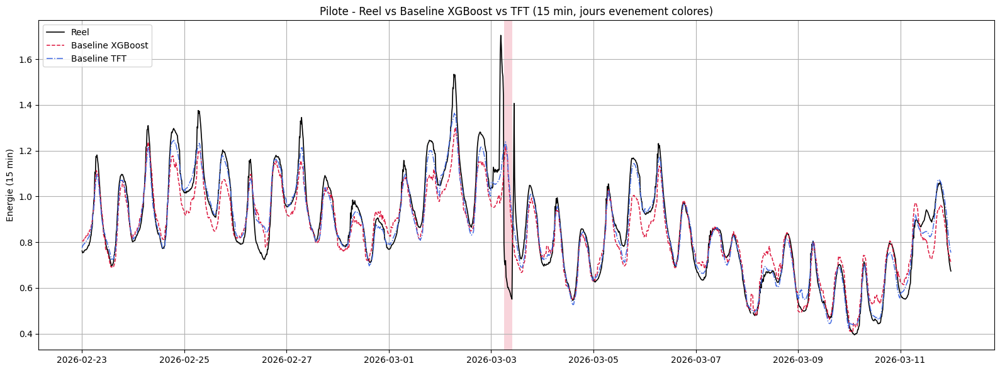
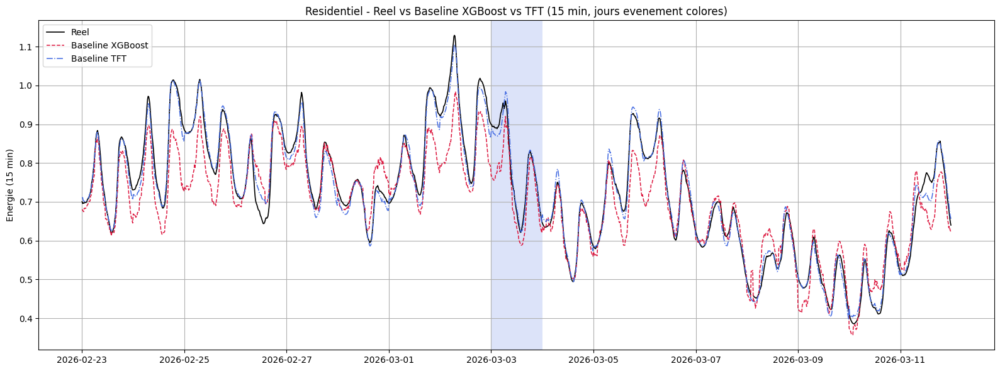
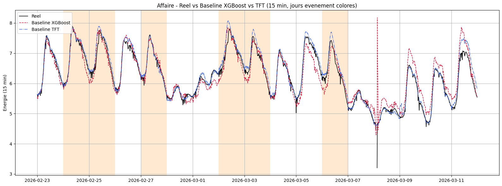
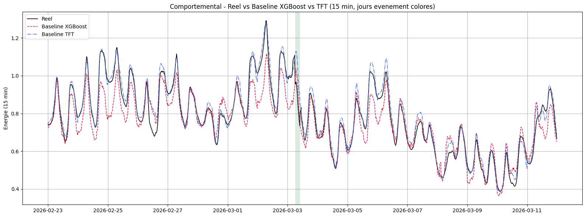

# ⚡ 15-Minute Counterfactual Baseline — XGBoost vs Temporal Fusion Transformer (TFT)

> Estimating *business-as-usual* electricity consumption at **15-minute** granularity for four customer segments, in order to **measure demand response** (curtailed energy, pre-charge, rebound) during demand-management events.


---

## 📌 Table of Contents

- [Business Context](#-business-context)
- [Objective](#-objective)
- [Pipeline Architecture](#-pipeline-architecture)
- [The 4 Modeled Segments](#-the-4-modeled-segments)
- [Key Features](#-key-features)
- [Notebook Structure](#-notebook-structure)
- [Requirements & Installation](#-requirements--installation)
- [Configuration](#-configuration)
- [Execution](#-execution)
- [Results](#-results)
- [Key Design Choices](#-key-design-choices)
- [Troubleshooting (fixed known errors)](#-troubleshooting-fixed-known-errors)
- [Skills Demonstrated](#-skills-demonstrated)
- [Limitations & Future Work](#-limitations--future-work)

---

## 🎯 Business Context

During a **demand-management event** (load curtailment, capacity call), an electricity provider asks customers to reduce their consumption. To quantify the real effect of these events, we must answer a counterfactual question:

> *"What **would** consumption have been if there had been **no** event?"*

This hypothetical consumption is called the **baseline**. By comparing the predicted baseline to actual consumption on event days, we measure three quantities:

| Quantity | Definition |
|----------|-----------|
| **Curtailed energy** | Consumption deficit on event day D (baseline − actual) |
| **Pre-charge** | Consumption surplus the day before (D-1), in anticipation |
| **Rebound** | Consumption surplus the day after (D+1), from deferred load |

**Net avoided energy** = curtailed energy − pre-charge − rebound.

---

## 🎯 Objective

Build a **reliable, unbiased, and leakage-free** baseline at **15-minute** granularity (no hourly aggregation), then **compare two model families**:

1. **XGBoost** — gradient-boosted trees (Part 1)
2. **Temporal Fusion Transformer (TFT)** — deep learning model for time series (Part 2)

The comparison is performed **on clean days** (non-event days), where the baseline should closely match the actual consumption.

---

## 🏗 Pipeline Architecture

```
┌──────────────────────────────────────────────────────────────┐
│  DATA (Spark SQL)                                            │
│  4 consumption segments + weighted weather + events          │
└───────────────────────────┬──────────────────────────────────┘
                            ▼
┌──────────────────────────────────────────────────────────────┐
│  15-MIN PREPARATION                                          │
│  • Regular 15-min grid (96 steps/day)                       │
│  • Gap handling, exclusion of non-finite labels             │
│  • Automatic maintenance / rebound detection                │
└───────────────────────────┬──────────────────────────────────┘
                            ▼
┌──────────────────────────────────────────────────────────────┐
│  FEATURE ENGINEERING                                         │
│  • Calendar + cyclical encoding (sin/cos)                   │
│  • Lagged weather (24h lag, 24h delta), temp interactions   │
│  • Per-slot reference profiles (anti-NaN fallback)          │
└───────────────────────────┬──────────────────────────────────┘
                            ▼
        ┌───────────────────┴───────────────────┐
        ▼                                       ▼
┌────────────────────┐                 ┌────────────────────┐
│  PART 1: XGBoost    │                 │  PART 2: TFT        │
│  • Residual target  │                 │  • Encoder 7 d real │
│  • HDD/CDD monotonic│                 │  • Decoder 96 steps │
│  • Pseudo-Huber     │                 │    (calendar +      │
│  • Local debiasing  │                 │     weather, NO leak)│
│  • Clipping         │                 │  • Rolling day-by-day│
└─────────┬──────────┘                 └─────────┬──────────┘
          └──────────────────┬────────────────────┘
                            ▼
┌──────────────────────────────────────────────────────────────┐
│  SUMMARIES & COMPARISON                                      │
│  • Per-segment metrics (RMSE, MAE, R², BIAS)                │
│  • Daily summary with status                                │
│  • Load-shifting balance                                    │
│  • XGBoost vs TFT on clean days → winner by R²              │
└──────────────────────────────────────────────────────────────┘
```

---

## 🗂 The 4 Modeled Segments

| Segment | Description | Plot color |
|---------|-------------|------------|
| **Controlled** | Actively controlled customers (curtailment) | Crimson |
| **Residential** | Residential customers | Royal blue |
| **Business** | Commercial / industrial customers | Dark orange |
| **Behavioral** | **Non-**controlled customers (behavioral response) | Sea green |

The pipeline is **generic**: functions read a segment configuration (`SEGMENTS`) rather than hard-coded column names, enabling a single loop over all 4 segments.

---

## ✨ Key Features

### Part 1 — XGBoost
- ✅ **Residual target**: the model predicts `energy − reference_profile`, which is easier to learn.
- ✅ **Monotonic constraints** on HDD/CDD → physically coherent baseline (colder = higher consumption).
- ✅ **Robust objective** (`reg:pseudohubererror`) → less sensitive to outliers.
- ✅ **Local debiasing**: bias recalibration over a recent window (30 days).
- ✅ **Clipping** of predictions between quantiles.
- ✅ **Automatic maintenance detection** to avoid polluting training.

### Part 2 — TFT
- ✅ **Strict anti-leakage**: the decoder only sees calendar and weather, **never** the event.
- ✅ **Rolling day-by-day baseline**: encoder = 7 real days, decoder = 96 future steps.
- ✅ **Persistence**: models saved to persistent storage for reuse (no unnecessary retraining).
- ✅ **Automatic GPU/CPU detection**.
- ✅ **Reproducibility**: fixed seeds (`SEED`, `SEED_TFT`).

---

## 📓 Notebook Structure

### Part 1 — XGBoost Baseline (cells 1 to 20)

| Cell | Role |
|------|------|
| 1 | Imports and configuration (auto-install of packages) |
| 2 | Global parameters (granularity, test window, flags) |
| 3 | GPU / CPU detection |
| 4 | Merged Spark SQL load (4 segments + weighted weather) |
| 5 | Configuration of the 4 segments |
| 6 | Alignment onto 15-min grid |
| 7 | Event variables (pre/post phases) |
| 8 | Maintenance / rebound detection |
| 9 | Common features (calendar, cyclical, lagged weather) |
| 10 | Baseline train masks + reference profiles (anti-NaN) |
| 11 | Feature lists |
| 12 | XGBoost model (monotonicity, robust objective) |
| 13 | Baseline training (NaN-label fix) |
| 14 | Full per-segment pipeline |
| 15 | Performance summary |
| 16 | Daily summary with status |
| 17 | Load-shifting energy balance |
| 18 | Actual vs Baseline plot |
| 19 | Feature importance |
| 20 | Spark view export |

### Part 2 — XGBoost vs TFT Comparison (cells P2.1 to P2.9)

| Cell | Role |
|------|------|
| P2.1 | TFT imports (torch, lightning, pytorch-forecasting) |
| P2.1bis | Writable checkpoint folder (PermissionError fix) |
| P2.1ter | Persistent model folder |
| P2.2 | TFT hyperparameters |
| P2.3 | Segment preparation for the TFT |
| P2.4 | TFT training (or model reloading) |
| P2.5 | Rolling day-by-day TFT baseline |
| P2.6 | TFT execution on the 4 segments |
| P2.7 | XGBoost vs TFT comparative summary |
| P2.8 | Actual vs XGBoost vs TFT plots |
| P2.9 | Spark view export |

---

## 🔧 Requirements & Installation

### Environment
- **Spark** platform with an ML cluster (CPU or **GPU** recommended for the TFT).
- Access to **persistent** storage for saving models.
- Python 3.10+.

### Dependencies (auto-installed by the notebook)
```bash
xgboost>=2.0
scikit-learn
numpy
pandas
matplotlib
torch
lightning
pytorch-forecasting
```

> The notebook includes an `_assurer(pkg, pip_name)` helper that automatically installs any missing package. No manual installation is required.

---

## ⚙️ Configuration

The main parameters are centralized in **cell 2**:

```python
# Granularity
FREQ           = "15min"
PAS_PAR_JOUR   = 96          # 24 h × 4 slots

# Backtest window
DATE_TEST       = "2026-03-03"
NB_JOURS_AVANT  = 8
NB_JOURS_APRES  = 8

# Toggleable improvements (boolean flags)
MODE_CIBLE_RESIDU        = True
UTILISER_MONOTONE        = True
DEBIASAGE_LOCAL          = True
CLIP_PREDICTIONS         = True
DETECTER_MAINTENANCE     = True
OBJECTIF_XGB             = "reg:pseudohubererror"
```

For the TFT (cells P2.2 and P2.1ter):

```python
ENC_JOURS       = 7          # encoder = 7 real days (672 steps)
DEC_JOURS       = 1          # decoder = 1 day (96 steps)
MAX_EPOCHS      = 30
HIDDEN_SIZE     = 32
ATTENTION_HEADS = 4

REENTRAINER_TFT = False       # True = force a full retraining
MODELE_DIR      = "<persistent_storage_path>"   # model persistence
```

> ⚠️ **Confidentiality**: set `MODELE_DIR` and source tables through **environment variables** or a non-versioned config file (see `.gitignore`). Never commit internal paths or table names.

---

## ▶️ Execution

1. Open the notebook on the Spark platform.
2. Attach an **ML** cluster (GPU recommended for Part 2).
3. Check / adjust the parameters in cell 2 (especially `DATE_TEST`).
4. **Run All**.

**Logical order**:
- Part 1 (cells 1→20) produces `resultats_segments` (data + XGBoost baseline).
- Part 2 (P2.1→P2.9) **reuses** `resultats_segments`, trains/reloads the TFTs, then compares.

> ⏱ On the first run, the TFTs are trained and saved. On subsequent runs, they are **automatically reloaded** (`REENTRAINER_TFT = False`), which greatly speeds up execution.

---

## 📊 Results

> ℹ️ Values from a run on the test window `DATE_TEST = 2026-03-03` (±8 days), evaluated **on clean days** (non-event days).

### 🏆 XGBoost vs TFT Comparison

| Segment | Model | RMSE | MAE | R² | BIAS | N |
|---------|-------|------|-----|-----|------|---|
| **Controlled** | XGBoost | 0.0682 | 0.0528 | 0.8976 | −0.0196 | 1532 |
| **Controlled** | **TFT** | **0.0402** | **0.0302** | **0.9644** | **−0.0080** | 1532 |
| **Residential** | XGBoost | 0.0614 | 0.0462 | 0.8375 | −0.0256 | 1532 |
| **Residential** | **TFT** | **0.0183** | **0.0140** | **0.9856** | **−0.0026** | 1532 |
| **Business** | XGBoost | 0.2944 | 0.2152 | 0.8470 | 0.0740 | 1052 |
| **Business** | **TFT** | **0.1423** | **0.0935** | **0.9643** | **0.0535** | 1052 |
| **Behavioral** | XGBoost | 0.0723 | 0.0534 | 0.8406 | −0.0278 | 1532 |
| **Behavioral** | **TFT** | **0.0327** | **0.0250** | **0.9673** | **0.0171** | 1532 |

### 🥇 Winner by Segment (summary)

| Segment | R² XGBoost | R² TFT | Winner | R² Gain |
|---------|:----------:|:------:|:------:|:-------:|
| Controlled | 0.898 | **0.964** | 🔵 TFT | **+0.067** |
| Residential | 0.837 | **0.986** | 🔵 TFT | **+0.148** |
| Business | 0.847 | **0.964** | 🔵 TFT | **+0.117** |
| Behavioral | 0.841 | **0.967** | 🔵 TFT | **+0.127** |

### 🔑 Key Takeaways

- 🔵 **The TFT outperforms XGBoost on all 4 segments**, with R² consistently above **0.96**.
- 📉 **Dramatic error reduction**: on **Residential**, RMSE drops from **0.0614 → 0.0183** (÷3.4) and R² rises to **0.986**.
- ⚖️ **Strongly reduced bias**: on **Residential**, bias goes from −0.0256 to −0.0026 (near zero), indicating a baseline that is not systematically offset.
- 💼 **Business segment** (the hardest, energy scale ~6–8): RMSE roughly halved (0.294 → 0.142) with an R² gain of **+0.117**.
- 📈 **Average TFT R² gain ≈ +0.115** across all segments.

### 📊 Plots — Actual vs XGBoost vs TFT Baseline (15 min)

> Place the images in an `assets/` folder in the repository. The **black** curve is the actual consumption, the **dashed red** is the XGBoost baseline, and the **blue** is the TFT baseline. Colored bands mark **event slots**.

**Controlled Segment**


**Residential Segment**


**Business Segment**


**Behavioral Segment**


> These plots visually confirm that the **TFT baseline (blue) tracks the actual consumption much more closely** than XGBoost (red), especially on consumption peaks and outside event days — consistent with the metrics above.

### Metrics computed
`RMSE` · `MAE` · `R²` · `BIAS` · `N`

### Tables (exported as Spark temporary views)
| Spark view | Content |
|------------|---------|
| `perf_test_15min_par_segment` | Per-segment metrics (all days vs clean days) |
| `resume_journalier_test_15min` | Day-by-day detail with status |
| `bilan_deplacement_charge_15min` | Curtailed energy, pre-charge, rebound, net avoided energy |
| `comparaison_xgb_tft_15min` | XGBoost vs TFT metrics |
| `resume_gagnant_xgb_tft_15min` | Winner per segment + R² gain |
| `detail_baselines_xgb_tft_15min` | Slot-by-slot detail of both baselines |

---

## 💼 Skills Demonstrated

- **Time series**: counterfactual baseline, thermal carryover, cyclical encoding.
- **Machine Learning**: XGBoost with monotonic constraints, robust objective, debiasing.
- **Deep Learning**: Temporal Fusion Transformer (pytorch-forecasting), encoder/decoder handling, anti-leakage.
- **Data Engineering**: Spark SQL, multi-source joins, weighted weather.
- **MLOps**: model persistence, GPU/CPU detection, reproducibility, environment error handling.
- **Analytical rigor**: evaluation on clean days, multiple metrics, visual validation.

---

## 🚀 Limitations & Future Work

- ⏳ **Uncertainty**: expose **prediction intervals** (the TFT already supports this via `QuantileLoss`).
- 📅 **Temporal cross-validation** across multiple `DATE_TEST` values rather than a single date.
- 🌡 **Advanced thermal carryover**: lagged effect with a shifted peak instead of a fixed 24h lag.
- 🔁 **Multi-event backtest** to make the load-shifting balance more robust.
- 📈 **MLflow tracking** of runs (metrics, artifacts, version comparison).

---

## 📄 License & Usage

This code illustrates a methodology for **measuring demand-response load curtailment** in energy at 15-minute granularity. The underlying data is confidential and **not included** in this repository.

---

> *Methodology applicable to consumption-segment modeling (Controlled / Residential / Business / Behavioral) — 15-minute granularity, no hourly aggregation.*
